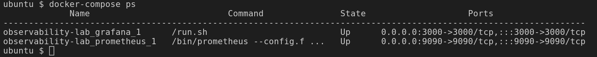

# Atividade Prática Observabilidade

Desafio final do curso de Monitoramento e Observabilidade da O2B Academy.

# Repositório original e base do desafio
Respositório do [Professor Patrick J. Cardoso](https://gitlab.com/patrickjcardoso/desafio-observabilidade.git)

## Objetivo do Laboratório:

Criar um ambiente de observabilidade usando Prometheus e Grafana para monitorar uma aplicação de exemplo.

## Technologies Used:

* Linux (Ubuntu based)
* Python Application
* Prometheus
* Grafana
* Docker compose
* AlertManager
* Webhook
* Docker

## Pré-requisitos:

* Você precisará de uma máquina Linux (pode ser uma VM, um servidor ou mesmo uma máquina local com Docker instalado).
* Conhecimento básico de linha de comando do Linux.
* Docker instalado na máquina.
* Uma aplicação de exemplo para monitorar (exemplo simples em Python).
* Clonar o repositório da atividade.

## Passos:

### Passo 1(Opcional): Instalação do Docker compose, Prometheus e Grafana

1.1. Baixe o Docker Compose e instale-o em sua máquina se você ainda não o tiver:

  
   ```console
    $ sudo curl -L "https://github.com/docker/compose/releases/latest/download/docker-compose-$(uname -s)-$(uname -m)" -o /usr/local/bin/docker-compose
    $ sudo chmod +x /usr/local/bin/docker-compose
   ```
  
    
1.2. **Clone o repositório** e acesse o diretório do laboratório:

    $ cd desafio_o11y/observability-lab

1.3. Crie um arquivo **docker-compose.yml** para definir os serviços Prometheus e Grafana:


```yaml
version: '3'
services:
  prometheus:
    image: prom/prometheus
    volumes:
    - ./prometheus/prometheus.yml:/etc/prometheus/prometheus.yml
    command:
    - '--config.file=/etc/prometheus/prometheus.yml'
    ports:
      - '9090:9090'
    network_mode: "host"

  grafana:
    image: grafana/grafana
    ports:
    - '3000:3000'
    network_mode: "host"
```

1.4. Crie um diretório chamado **prometheus** e, dentro dele, crie um arquivo **prometheus.yml** para configurar o Prometheus:

  ```yaml
global:
  scrape_interval: 15s

scrape_configs:
- job_name: 'prometheus'
  static_configs:
    - targets: ['localhost:9090']
- job_name: 'your-app'
  static_configs:
    - targets: ['your-app-container:your-app-port']
  ```

* **Dica:** Você precisará ajustar a identação do arquivo
### Passo 1(oficial): Configurando Docker compose e Iniciando o Ambiente de Observabilidade
1.1 Após clonar o repositório, acesse o diretório que contém o docker compose.
    pwd
    ls
    cd
1.2 Coloque os seguintes comando para iniciar os serviços Prometheus e Grafana:

    $ docker-compose up -d

1.3 Certifique-se que os containers do Prometheus e do Grafana subiram e estão funcionando:

    $ docker-compose ps

### Passo 2: Configurando a Aplicação de Exemplo

2.1 Certifique-se de que você tenha o **Flask** e o **Prometheus Client** Python instalados. Você pode instalá-los usando o pip:

    pip install Flask prometheus_client

2.2 Acesso o diretório da aplicação:

    $ cd python-app

* Abra o arquivo **app.py** e analise o código fonte, perceba que existem algumas rotas criadas.
* A porta que está sendo exposta sua aplicação é a 3001, você pode alterar caso seja necessário.


2.3 Inicie sua aplicação e exponha-a em uma porta específica.

```console
python app.py
```

2.5 Testando a aplicação python.

Sua aplicação estará disponível em http://localhost:3001. Você pode acessar a página inicial e também verificar as métricas expostas em http://localhost:3001/metrics.


### Passo 3: Gerando métricas na aplicação

Acesse sua aplicação em clique em: Gerar Erro e depois em Calcular Duração

### Passo 4: Configurar o Prometheus no Laboratório 

No arquivo **prometheus.yml** no diretório prometheus (conforme configurado anteriormente), adicione ou ajuste a seguinte seção sob **scrape_configs** para coletar métricas da sua aplicação python:


```yaml
- job_name: 'nodejs-app'
  static_configs:
    - targets: ['your-app-container:your-app-port']
```

* Certifique-se de substituir **'your-app-container:your-app-port'** pelo host e porta onde sua aplicação python está sendo executada.



### Passo 5: Testando a segunda aplicação(opcional)
5.1 Abra um novo terminal.

5.2 Acesse a pasta python/

5.3 Dê o seguinte comando para iniciar a aplicação


    python eve.py

5.4 Acesse na porta http://localhost:3002.

[Código](/prints/2aplicação.png) 

[Aplicação](/prints/eve-py.png) 

### Passo 6: Acessando o Promethues e verificando as métricas da aplicação

6.1 Acesse o painel Promethues em seu navegador em http://localhost:9090.

6.2 Verifique so o Prometheus está conseguindo acessar os dados da sua aplicação. 

* Clique no menu **Status** e depois em **Targets**.

  * O status deve estar UP para ambos os targets (Prometheus e your-app)
  * Caso o status da aplicação não esteja UP, certifique-se que a aplicação esteja rodando (Item 2.3).
  * Caso ainda não esteja UP ou com outro status, reveja a atividade, pois algum ponto pode ter faltado.

  [Targets](/prints/PrometheusTargets.png)

  [Rules](/prints/PrometheusRules.png)

  [Table](/prints/PrometheusTable8.png)


6.3 Agora vamos olhar as métricas configuradas em nossa aplicação:

* Métrica de Contagem de Erros (app_errors_total): Esta métrica conta o número total de erros que ocorreram em sua aplicação.
* Métrica de Duração da Função (app_function_duration_seconds): Esta métrica mede o tempo gasto na execução de funções específicas em sua aplicação. Você configurou rótulos para identificar a função específica sendo monitorada.

### Passo 7: Configurando o Grafana

7.1. Acesse o painel Grafana em seu navegador em http://localhost:3000.

7.2. Faça login com as credenciais padrão (username: admin, password: admin).

7.3. Configure o Prometheus como uma fonte de dados:

* Clique em "Home" no menu à esquerda.
* Clique em "Connections" e,"Data source' em seguida, em "Add data source".
* Escolha "Prometheus" como o tipo de fonte de dados.
* Na seção "HTTP", configure o URL para http://prometheus:9090.
* Clique em "Save & Test".

### Passo 8: Criando um Painel no Grafana

8.1. Crie um novo painel clicando em "Home" e escolha "Dashboard".

8.2. Clique em "create Dashboard" e clique "add visualization".

8.3. Selecione o Prometheus como fonte de origem.

8.4. Selecione a métrica que gostaria de adicionar ao dashboard na opção de metric (app_erros_total), Adicione um título para o painel na opção Title, Clique em Run queries para gerar o gráfico e clique em apply.

[Grafana](/prints/Grafana8.png)


### Passo 9: Configurando e gerando alerta com o Alertmanager.
9.1 Acesse o Webhook e copie a URL fornecida por lá.

9.2 Cole a URL no local específicado no arquivo alertmanager.yml

    global:

    resolve_timeout: 5m

    route:

      receiver: webhook_receiver

    receivers:

    - name: webhook_receiver

      webhook_configs:

        - url: 'https://webhook.site/8f062bd0-626c-42fc-85ee-1970fc4fb00b'

          send_resolved: false


[Webhook](/prints/WebhookPost.png)

**Dica:** Utilize a documentação do promethues e docker para fazer consultas e finalizar essa etapa.

